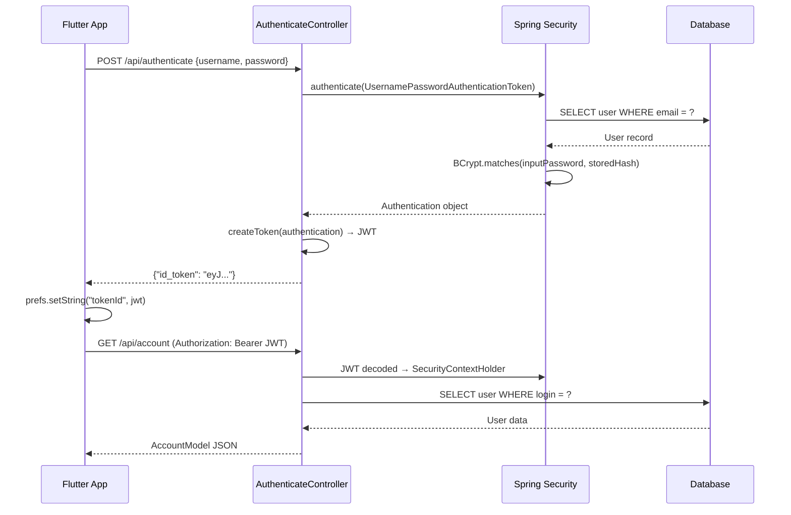
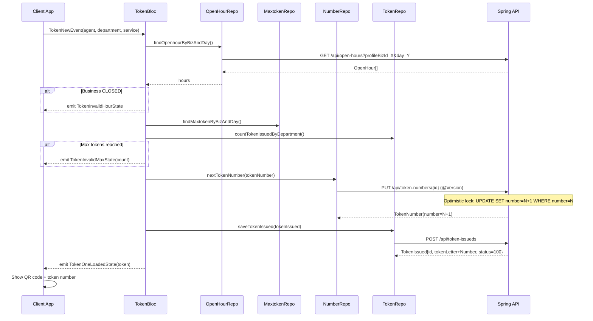

# PaperlessQMS — Complete Enterprise Technical Documentation

> **Version:** 2.0.0+3 | **License:** OSL 3.0 | **Author:** Wheref.com | **Generated:** 2026-05-17

---

## Table of Contents

1. [Project Overview](#section-1--project-overview)
2. [Project Structure Breakdown](#section-2--project-structure-breakdown)
3. [Application Flow](#section-3--application-flow)
4. [Detailed File Relationships](#section-4--detailed-file-relationships)
5. [Database & Data Flow](#section-5--database--data-flow)
6. [API Documentation](#section-6--api-documentation)
7. [Authentication & Security](#section-7--authentication--security)
8. [State Management](#section-8--state-management)
9. [UI/UX Architecture](#section-9--uiux-architecture)
10. [Configuration & Environment](#section-10--configuration--environment)
11. [Step-by-Step Run Guide](#section-11--step-by-step-run-guide)
12. [Code Quality Review](#section-12--code-quality-review)
13. [Design Patterns & Architecture](#section-13--design-patterns--architecture)
14. [Testing Analysis](#section-14--testing-analysis)
15. [DevOps & Deployment](#section-15--devops--deployment)
16. [Learning Mode](#section-16--learning-mode)
17. [Visualization Diagrams](#section-17--visualization-diagrams)
18. [Final Engineering Review](#section-18--final-engineering-review)
19. [Glossary](#glossary)
20. [Checklists](#checklists)

---

## SECTION 1 — PROJECT OVERVIEW

### What This Project Does

**PaperlessQMS** is a **digital Queue Management System (QMS)** — the software equivalent of the numbered-ticket dispensers seen at banks, hospitals, and government offices. It replaces physical paper tickets with a fully digital, real-time queue experience accessible from any device with a browser or mobile phone.

### Business Purpose

Organizations with walk-in service models (clinics, banks, government departments, retail service centers) need to manage customer wait times fairly and efficiently. PaperlessQMS solves this by:

- Issuing digital queue tokens to customers.
- Routing tokens to service agents at numbered counters/terminals.
- Broadcasting real-time status updates so customers know when their turn is approaching.
- Recording every transaction for analytics and performance management.

### The Problem It Solves

| Old Way | PaperlessQMS Way |
|---|---|
| Physical paper tickets | Digital tokens with QR codes |
| Customers must stay near the counter | Customers can wait anywhere, notified in real-time |
| No audit trail | Full history: every status change timestamped |
| Manual counter management | Agent apps for calling, recalling, transferring |
| No performance data | Built-in statistics dashboard with charts |

### Intended Users

| Role | Application Used | Description |
|---|---|---|
| **Customer / Visitor** | `paperlessqms-client` | Takes a queue token, monitors their position |
| **Service Agent / Staff** | `paperlessqms-call` | Calls the next customer to their counter |
| **Business Administrator** | `paperlessqms-admin` | Configures the system, views analytics |
| **System Administrator** | Spring Backend API | Manages users, monitors system health |

### Core Features

- **Multi-business support**: One backend serves multiple businesses (`ProfileBiz`).
- **Hierarchical queue structure**: Business → Department → Service → Token.
- **Real-time updates**: WebSocket (STOMP/SockJS) pushes token status changes instantly.
- **Token lifecycle management**: 7 distinct statuses (Waiting → Queueing → Completed/Timeout/Transfer/Cancel/Recall).
- **Business rules engine**: Open hours validation, maximum daily token cap.
- **QR code integration**: Customers scan a QR code to take a token or check status.
- **Star-rating feedback**: Customers rate service 1–5 stars after completion.
- **Statistical dashboard**: Charts for token counts by status, rating breakdowns, daily trends.
- **Captcha protection**: reCAPTCHA on login to prevent bots.
- **Multi-platform**: Web (Flutter Web), iOS, Android from a single codebase.

### High-Level Workflow

```
[Customer arrives at business]
        ↓
[Opens Client App → selects business/department/service]
        ↓
[System validates: is business open? is max token reached?]
        ↓
[TokenNumber atomically incremented → TokenIssued created (Status: WAITING)]
        ↓
[WebSocket broadcasts new token event to agent's Call App]
        ↓
[Agent in Call App sees token in queue → clicks "Call"]
        ↓
[TokenIssued status → QUEUEING → WebSocket notifies customer]
        ↓
[Customer approaches counter → Agent marks COMPLETED]
        ↓
[Customer rates the service (1–5 stars)]
        ↓
[Data stored for analytics in Admin dashboard]
```

### Technologies Used

#### Backend
| Technology | Version | Why Chosen |
|---|---|---|
| **Java** | 22 | Latest LTS for modern features, records, switch expressions |
| **Spring Boot** | 3.2.0 | Industry-standard, auto-configuration, production-ready |
| **JHipster** | 8.1.0 | Code generator that bootstraps enterprise Spring patterns |
| **Spring Security** | 6.x | OAuth2 resource server, method-level security |
| **JWT (nimbus-jose-jwt)** | via Spring Security | Stateless auth — no server-side session storage needed |
| **Hibernate / JPA** | 6.3.1 | ORM for database-agnostic entity persistence |
| **Liquibase** | 4.24.0 | Incremental, versioned DB schema migrations |
| **PostgreSQL** | 16.1 (Docker) | Production-grade relational database |
| **H2** | 2.2.224 | Embedded in-memory/file DB for dev — zero setup |
| **Ehcache** | 3.x | Second-level cache for Hibernate, reduces DB load |
| **WebSocket / STOMP** | Spring 6 | Real-time bidirectional communication for live queue updates |
| **SockJS** | via Spring | WebSocket fallback for environments that block WS |
| **Undertow** | via Spring Boot | Lightweight, high-performance servlet container |
| **Springdoc OpenAPI** | 2.x | Auto-generates REST API documentation |
| **MapStruct** | 1.5.5 | Compile-time DTO ↔ Entity mapping |
| **Micrometer + Prometheus** | via Spring | Metrics collection for monitoring |
| **Jib** | 3.4.0 | Container image building without Docker daemon |
| **Thymeleaf** | via Spring Boot | Email templates |

#### Frontend (Flutter / Dart)
| Technology | Version | Why Chosen |
|---|---|---|
| **Flutter** | SDK ≥3.2.6 | Single codebase for Web, iOS, Android |
| **Dart** | SDK ≥3.2.6 | Strong-typed, null-safe, compiles to native & JS |
| **flutter_bloc** | ^8.1.6 | Predictable state management (BLoC pattern) |
| **provider** | ^6.1.x | Lightweight state for theme/app-level state |
| **get_it** | ^7.6.7 | Service locator for dependency injection |
| **dio** | ^5.4.2 | HTTP client with interceptors |
| **stomp_dart_client** | ^1.0.2 | STOMP protocol over WebSocket |
| **flex_color_scheme** | ^8.4.0 | Adaptive Material Design theming |
| **flutter_local_notifications** | ^16.3.2 | Local push notifications (client app) |
| **qr_flutter** | ^4.1.0 | QR code display |
| **qr_code_dart_scan** | ^0.8.1 | QR code scanning |
| **shared_preferences** | ^2.2.2 | Persistent local key-value storage (JWT, account) |
| **flutter_login** | ^5.0.0 | Pre-built animated login UI |
| **catcher_2** | ^1.2.6 | Crash reporting |
| **intl** | ^0.20.2 | Internationalization |
| **d_chart** | ^2.6.7 | Charts for admin statistics |
| **flutter_rating_bar** | ^4.0.1 | Star-rating UI |

---

## SECTION 2 — PROJECT STRUCTURE BREAKDOWN

### Repository Root Tree

```
paperlessqms_opensource/
├── .gitignore
├── LICENSE.txt                          # OSL 3.0 license
├── package-lock.json                    # Node.js lockfile (for frontend build toolchain)
├── paperlessqms-flutter/                # ALL Flutter code
│   ├── buildweb.sh                      # Shell script to build all web apps
│   ├── clean.sh                         # Shell script to clean all Flutter apps
│   ├── paperlessqms-admin/              # Admin Flutter App
│   ├── paperlessqms-call/               # Agent (Call) Flutter App
│   ├── paperlessqms-client/             # Customer Flutter App
│   └── paperlessqms-common/             # Shared Flutter library (the most important)
├── paperlessqms-spring/                 # Spring Boot Backend API
│   ├── pom.xml                          # Maven project definition
│   ├── checkstyle.xml                   # Code style rules
│   └── src/
│       ├── main/
│       │   ├── docker/                  # Docker Compose files
│       │   ├── java/com/wheref/paperlessqms/
│       │   │   ├── PaperlessqmsApp.java  # Application entry point
│       │   │   ├── aop/                 # Aspect-oriented: logging
│       │   │   ├── config/              # All Spring configuration classes
│       │   │   ├── domain/              # JPA entity classes
│       │   │   ├── management/          # Security metrics
│       │   │   ├── repository/          # Spring Data JPA repositories
│       │   │   ├── security/            # Auth utilities, user details
│       │   │   ├── service/             # Business logic + criteria + DTOs + mappers
│       │   │   └── web/
│       │   │       ├── rest/            # REST controllers (API endpoints)
│       │   │       └── websocket/       # WebSocket message handlers
│       │   └── resources/
│       │       ├── config/              # application.yml + profiles
│       │       └── config/liquibase/    # DB migration changelogs
│       └── test/                        # Unit + Integration tests
└── paperlessqms-spring-client/          # Angular/webpack frontend (legacy/alternative web)
    └── webpack/                         # Webpack config for Angular frontend
```

---

### Backend: `paperlessqms-spring/`

#### `src/main/java/com/wheref/paperlessqms/`

**`PaperlessqmsApp.java`** — Entry point
- `@SpringBootApplication` — triggers component scan and auto-configuration.
- `@PostConstruct initApplication()` — validates that dev+prod profiles are not active simultaneously.
- `main()` — sets default Spring profile via `DefaultProfileUtil`, starts app, logs access URLs.

---

#### `config/` — Spring Configuration

| File | Responsibility |
|---|---|
| `ApplicationProperties.java` | Type-safe binding of custom `application:` YAML properties |
| `AsyncConfiguration.java` | Thread pool for `@Async` methods |
| `CacheConfiguration.java` | Ehcache setup; registers cache regions for each entity |
| `Constants.java` | Global constant strings (profile names, etc.) |
| `CRLFLogConverter.java` | Prevents log injection via CRLF characters in log messages |
| `DatabaseConfiguration.java` | JPA / datasource setup |
| `DateTimeFormatConfiguration.java` | Jackson date/time serialization format |
| `JacksonConfiguration.java` | Jackson ObjectMapper customization (Hibernate lazy-loading modules) |
| `LiquibaseConfiguration.java` | Liquibase async runner configuration |
| `LocaleConfiguration.java` | Locale/i18n resolver for HTTP |
| `LoggingAspectConfiguration.java` | Enables AOP logging aspect in dev profile only |
| `LoggingConfiguration.java` | Logstash appender setup |
| `SecurityConfiguration.java` | **Core security rules** — see Section 7 |
| `SecurityJwtConfiguration.java` | JWT encoder/decoder bean configuration |
| `WebConfigurer.java` | CORS filter, static resource serving |
| `WebsocketConfiguration.java` | STOMP/SockJS WebSocket endpoint setup |
| `WebsocketSecurityConfiguration.java` | Security rules for WebSocket messages |

---

#### `domain/` — JPA Entities

These are the heart of the data model. Each maps to a database table.

| Entity | Table | Key Fields | Purpose |
|---|---|---|---|
| `ProfileBiz` | `profile_biz` | `bizName`, `createdByUid`, `enable` | Business/organization profile |
| `QueueDepartment` | `queue_department` | `profileBizId`, `name`, `lat/lng`, `threshold`, `tokenTimeoutMin` | A physical service location/branch |
| `QueueService` | `queue_service` | `name`, `letter`, `start`, `profileBizId` | A type of service (e.g. "Account Opening", letter="A") |
| `QueueTerminal` | `queue_terminal` | `name`, `departmentId` | A service counter/window |
| `Agent` | `agent` | `uid`, `login`, `email`, `queueTerminal`, `queueDepartment` | Staff member linked to a terminal |
| `TokenNumber` | `token_number` | `number` (@Version), `departmentId`, `serviceId` | Optimistic-lock counter for next token |
| `TokenIssued` | `token_issued` | `uid`, `tokenLetter+tokenNumber`, `statusCode`, many timestamps | One queue ticket issued to one customer |
| `OpenHour` | `open_hour` | `startHour`, `endHour`, `dayNum` | Business opening hours per day |
| `MaxToken` | `max_token` | `maxToken`, `dayNum` | Max daily tokens per day |
| `User` | `jhi_user` | `login`, `email`, `activated`, `authorities` | System user account |
| `Authority` | `jhi_authority` | `name` | Role (ROLE_USER, ROLE_ADMIN) |

**Critical detail — TokenNumber with `@Version`:**
```java
@Version
@Column(name = "number")
private Long number;
```
The `@Version` annotation enables **optimistic locking**. When two customers try to take a token simultaneously, the database rejects the second update (throws `OptimisticLockException`). This prevents two people getting the same number — the token counter is concurrency-safe without pessimistic row locking.

**TokenIssued is the richest entity** with 50+ columns — it denormalizes names, all timestamps (created, assigned, completed, modified, transferred) with timezone info, the full status machine state (8 boolean flags + statusCode), rating, and feedback.

---

#### `repository/` — Spring Data JPA Interfaces

Each entity has a `XxxRepository extends JpaRepository<Xxx, Long>` plus `JpaSpecificationExecutor<Xxx>` for dynamic filtering.

Examples:
- `TokenIssuedRepository` — queries by `profileBizId`, `departmentId`, `serviceId`, `terminalId` (all indexed).
- `TokenNumberRepository` — used for atomic increment via `@Version`.

---

#### `service/` — Business Logic

Each domain entity follows the pattern:
- `XxxService` — CRUD operations delegating to repository.
- `XxxQueryService` — Dynamic filtering using `JpaSpecificationExecutor` and `XxxCriteria`.

| Service | Key Methods |
|---|---|
| `TokenIssuedService` | save, update, delete, findAll, findOne |
| `TokenNumberService` | Manages the optimistic-lock counter |
| `UserService` | Registration, activation, password reset |
| `MailService` | Sends activation/reset emails via Thymeleaf templates |

---

#### `web/rest/` — REST Controllers

| Controller | Base Path | Key Endpoints |
|---|---|---|
| `AuthenticateController` | `/api` | POST `/authenticate`, GET `/authenticate` |
| `AccountResource` | `/api/account` | GET (check), POST (update), `reset-password/*` |
| `ProfileBizResource` | `/api/profile-bizs` | CRUD for businesses |
| `QueueDepartmentResource` | `/api/queue-departments` | CRUD for departments |
| `QueueServiceResource` | `/api/queue-services` | CRUD for services |
| `QueueTerminalResource` | `/api/queue-terminals` | CRUD for terminals |
| `AgentResource` | `/api/agents` | CRUD for agents |
| `TokenIssuedResource` | `/api/token-issueds` | CRUD + custom queries |
| `TokenNumberResource` | `/api/token-numbers` | Token counter operations |
| `OpenHourResource` | `/api/open-hours` | Business hours CRUD |
| `MaxTokenResource` | `/api/max-tokens` | Max daily limit CRUD |
| `UserResource` | `/api/admin/users` | User management (ADMIN only) |
| `PublicUserResource` | `/api/users` | Public user info |

---

#### `web/websocket/`

`ActivityService` — Handles STOMP messages:
- Receives on: `/topic/activity`
- Broadcasts to: `/topic/tracker`
- Also broadcasts disconnect events (`SessionDisconnectEvent`)

The `WebsocketConfiguration` registers the SockJS endpoint at `/websocket/tracker`. The Flutter apps subscribe to domain-specific topics like `/topic/tokenIssuedUid`, `/topic/runningToken`, etc.

---

### Common Flutter Library: `paperlessqms-common/`

This is the **most critical** Flutter package. All 3 apps depend on it via `path: ../paperlessqms-common`. It contains everything reusable.

#### `lib/` Tree

```
lib/
├── config.dart             # Server URL + protocol (dev vs prod)
├── locator.dart            # GetIt service locator setup
├── logger.dart             # Logging wrapper
├── app_theme.dart          # Theme provider (light/dark)
├── app_absorb.dart         # UI state provider (recaptcha verified?)
├── models/                 # Dart data models (mirror Spring entities)
├── bloc/                   # BLoC state machines (one per domain)
├── repositories/           # REST API calls per domain
├── services/               # BaseService (Dio HTTP client)
├── screens/                # Shared screens (Login, Scanner, Token display)
├── utils/                  # Constants, functions, WebSocket utils
├── widgets/                # Shared widgets (header, error box)
└── generated/              # Auto-generated i18n (intl)
```

#### `config.dart` — URL Configuration
```dart
const String protocol = kReleaseMode? 'https': 'http';
const String domainName = kReleaseMode? 'sample.co:8080': '127.0.0.1:8080';
```
**In dev mode**: all apps hit `http://127.0.0.1:8080`.
**In release mode**: update `sample.co:8080` to your production domain.

#### `services/base_service.dart` — HTTP Foundation
- Wraps `Dio` library.
- `createClient()` lazily initializes Dio with `DioLogger` interceptor.
- Methods: `getMethod`, `postMethod`, `putMethod`, `patchMethod`, `deleteMethod`.
- All methods handle `DioException` and return a structured error map `{ status, limit, error, data }`.
- `close()` disposes the Dio instance.

#### `services/rest_connect_service.dart` — Service Layer
Extends `BaseService`. Currently empty except for registration — acts as the singleton HTTP service registered with GetIt.

#### `locator.dart` — Dependency Injection
```dart
final GetIt locator = GetIt.instance;
Future<void> setupLocator() async {
  locator.registerLazySingleton(() => RestConnectService());
}
```
`RestConnectService` is a **lazy singleton** — created once, reused everywhere.

#### `utils/constants.dart` — API Endpoints & Status Codes
This is a critical file. It defines:
- All API URL constants (e.g., `Constants.apiTokenIssued = '$protocol://$domainName/api/token-issueds'`)
- All WebSocket topic constants
- Token lifecycle status codes (100 Waiting → 700 Cancel)
- `Prefs` keys for SharedPreferences
- `PrefsUtils` helper (reads JWT token, account, sign-out logic)
- `CommonUtils.resetBlocState()` — resets all BLoCs on sign-out

#### `utils/web_socket_utils.dart` — WebSocket Connection
```dart
StompClient connect(String urlWebSocket, Function(StompFrame) onConnect, List<HeaderModel>? headers)
```
Creates a `StompClient` over SockJS with JWT auth headers. Callbacks for connect, disconnect, error, debug.

---

### Flutter App: `paperlessqms-client/`

The **customer-facing** app. A customer uses this to take a token and monitor queue status.

#### `lib/main.dart`
1. Initializes `InitialApp.init()`.
2. Sets up `Catcher2` (crash reporter).
3. Calls `setupLocator()` (GetIt DI).
4. Calls `setHashUrlStrategy()` (Flutter Web URL routing uses `#` hash).
5. Wraps app in `Utils.buildProvider(prefs, MyApp(...))` — creates all BLoC providers.
6. `MyApp.build()` — checks JWT via `accountRepository.checkAccount()`:
   - If no valid account → shows `LoginScreen`.
   - If valid → shows `WayScreen`.

#### `lib/screens/way_screen.dart`
Bottom navigation bar with 3 tabs:
- **Home** (`HomeScreen`) — Take a new token, view current tokens
- **Completed** (`TokenCompletedScreen`) — View completed/cancelled tokens
- **More** (`MoreScreen`) — Profile, settings, sign out

---

### Flutter App: `paperlessqms-admin/`

The **administrator** app. Manages business setup and views analytics.

#### Screen Summary
| Screen | Purpose |
|---|---|
| `biz_page.dart` | List and select business |
| `setup_biz_page.dart` | Create/edit business profile |
| `department_page.dart` | Manage departments |
| `setup_queue_page.dart` | Manage services and terminals |
| `agent_page.dart` | Manage agents |
| `openhour_page.dart` | Set business hours |
| `maxtoken_page.dart` | Set max daily token limit |
| `terminal_page.dart` | Manage terminals |
| `stat_page.dart` | Statistics overview |
| `stat_rating_page.dart` | Rating breakdown chart |
| `stat_token_page.dart` | Token count chart |
| `more_page.dart` | Profile, password change, sign out |

---

### Flutter App: `paperlessqms-call/`

The **agent** app. Staff use this to call customers from the queue.

#### Screen Summary
| Screen | Purpose |
|---|---|
| `select_biz_screen.dart` | Select which business to work in |
| `select_agent.dart` | Select which agent identity to use |
| `token_list_page.dart` | View tokens in queue (status: QUEUEING, RECALL, TRANSFER) |
| `token_call_page.dart` | View tokens waiting to be called (status: WAITING, CANCEL) |
| `token_completed_page.dart` | View completed/timed-out tokens |
| `user_info_screen.dart` | Customer detail for a selected token |
| `more_page.dart` | Settings, sign out |

---

## SECTION 3 — APPLICATION FLOW

### Backend Startup

```
1. main() in PaperlessqmsApp.java
   └── SpringApplication.run()
       ├── Component scan: discovers all @Service, @Repository, @RestController, @Configuration
       ├── Auto-configuration: Undertow web server, JPA, Security, Cache, WebSocket
       ├── Liquibase runs changelogs → creates/migrates DB schema
       ├── Ehcache initialized → registers cache regions for entities
       ├── Security filter chain built → JWT resource server configured
       ├── WebSocket broker started → /websocket/tracker SockJS endpoint registered
       └── @PostConstruct initApplication() → validates active profiles
```

### HTTP Request Lifecycle (REST API)

```
HTTP Request
    ↓
[Undertow Server]
    ↓
[Spring Security Filter Chain]
    ├── JWT token extracted from "Authorization: Bearer <token>" header
    ├── Token decoded and validated (signature, expiry)
    └── Authentication set in SecurityContextHolder
    ↓
[CORS Filter] (WebConfigurer)
    ↓
[ExceptionTranslator] (as @ControllerAdvice)
    ↓
[REST Controller] (e.g., TokenIssuedResource)
    ├── @Valid validates request body
    ├── Calls Service layer
    │   └── Service calls Repository
    │       └── Repository executes JPA query (with Ehcache L2 cache check first)
    │           └── SQL sent to H2/PostgreSQL
    └── Returns ResponseEntity<>
    ↓
[Jackson serializer] → JSON response
    ↓
HTTP Response
```

### Flutter Client App Startup

```
main()
  ├── WidgetsFlutterBinding.ensureInitialized()
  ├── SharedPreferences.setPrefix(AppConstants.appPrefix)
  ├── Catcher2 crash reporter configured
  ├── AdaptiveDialog configured
  ├── setupLocator() → registers RestConnectService as GetIt singleton
  ├── setHashUrlStrategy() → Flutter Web URL uses #hash routing
  └── Catcher2(rootWidget: Utils.buildProvider(prefs, MyApp(...)))
       └── buildProvider() creates widget tree of BLoC providers:
           ├── BlocProvider<AccountBloc>
           ├── BlocProvider<BizBloc>
           ├── BlocProvider<DepartmentBloc>
           ├── BlocProvider<ServiceBloc>
           ├── BlocProvider<TerminalBloc>
           ├── BlocProvider<AgentBloc>
           ├── BlocProvider<TokenBloc>
           ├── BlocProvider<MaxtokenBloc>
           ├── BlocProvider<OpenhourBloc>
           ├── ChangeNotifierProvider<AppTheme>
           └── ChangeNotifierProvider<AppAbsorb>
```

### Authentication Flow (Detailed)

```
[User enters email + password in LoginScreen]
    ↓
LoginScreen._authUser()
    ↓
accountRepository.auth(body)
    ↓
POST http://127.0.0.1:8080/api/authenticate
    Body: {"username":"user@email.com","password":"xxx","rememberMe":true}
    ↓
AuthenticateController.authorize()
    ├── Creates UsernamePasswordAuthenticationToken
    ├── authenticationManagerBuilder.authenticate() 
    │   └── DomainUserDetailsService.loadUserByUsername()
    │       └── UserRepository.findOneByEmailIgnoreCase()
    │           └── Verifies BCrypt password hash
    ├── Creates JWT with claims: subject=login, auth=ROLE_USER ROLE_ADMIN
    └── Returns { "id_token": "eyJ..." }
    ↓
Flutter: prefs.setString(Prefs.tokenId, tokenId)
    ↓
Utils.pushPage(context, RecaptchaScreen(...))
    ↓
[reCAPTCHA verified] → AppAbsorb.setRecaptcha(true)
    ↓
WayScreen shown (main application)
```

### Token Issuance Flow (Critical Business Logic)

```
Customer selects business → department → service
    ↓
TokenBloc receives TokenNewEvent
    ↓
bizRepository.findProfileBizById(service.profileBizId)
    ↓
[VALIDATION 1: Open Hours]
openhourRepository.findOpenhourByBizAndDay(profileBiz, weekday, enable: true)
    if (now < openHour.start OR now > openHour.end) → emit TokenInvalidHourState
    ↓
[VALIDATION 2: Max Daily Token]
maxtokenRepository.findMaxtokenByBizAndDay(profileBiz, weekday, enable: true)
tokenRepository.countTokenIssuedByDepartment(department.id, reset: false)
    if (count >= maxToken) → emit TokenInvalidMaxState
    ↓
[GET NEXT TOKEN NUMBER - Atomic via Optimistic Locking]
numberRepository.countTokenNumberByDepartmentAndService(dep, service) → 0 or >0
    if 0: numberRepository.saveTokenNumber(new TokenNumberModel)
    else: numberRepository.nextTokenNumber(tokenNumber)
        → PUT /api/token-numbers/{id} with @Version increment
        → Database: UPDATE token_number SET number=number+1 WHERE id=? AND number=?
        → If another thread updated first: OptimisticLockException → retry
    ↓
[CREATE TOKEN ISSUED]
TokenIssuedModel created with:
    - statusCode: 100 (WAITING)
    - isPending: true, isQueue: false, isCompleted: false
    - all timestamps (createdDate, createdYear/Month/Day/Hour/Min, timezone)
    - issuedFrom: "client"
tokenRepository.saveTokenIssued(tokenIssued)
    → POST /api/token-issueds
    ↓
emit TokenOneLoadedState → UI shows QR code + token number
```

### WebSocket Real-Time Flow

```
[Token status changes on backend (e.g., Agent calls token)]
    ↓
TokenIssuedResource.partialUpdateTokenIssued() / updateTokenIssued()
    ↓
Spring: messagingTemplate.convertAndSend("/topic/tokenIssuedUid/{uid}", dto)
        messagingTemplate.convertAndSend("/topic/runningToken/{deptId}", dto)
    ↓
All connected STOMP clients subscribed to that topic receive the message
    ↓
Client App: WebSocketUtils.connect() creates StompClient
    stompClient.subscribe('/topic/tokenIssuedUid/$uid', (frame) {
        // update local token state
    });
    ↓
UI rebuilds showing new status (QUEUEING → green)
```

---

## SECTION 4 — DETAILED FILE RELATIONSHIPS

### Dependency Chain Diagram

```
paperlessqms-spring (Backend API)
    └── serves REST + WebSocket endpoints consumed by:

paperlessqms-common (shared library)
    ├── services/base_service.dart ← services/rest_connect_service.dart
    ├── repositories/* ← uses rest_connect_service via locator
    ├── bloc/* ← uses repositories
    ├── screens/* ← uses blocs + repositories
    └── utils/constants.dart ← defines all API URLs

paperlessqms-client depends on:
    ├── paperlessqms-common (path dependency)
    └── client-specific screens

paperlessqms-admin depends on:
    ├── paperlessqms-common (path dependency)
    └── admin-specific screens

paperlessqms-call depends on:
    ├── paperlessqms-common (path dependency)
    └── call-specific screens
```

### Repository ↔ Service ↔ Controller Chain (Backend)

```
HTTP Request
    → TokenIssuedResource (Controller)
        → TokenIssuedService (queries findAll, save, update, delete)
            → TokenIssuedRepository (JPA interface)
                → Hibernate ORM
                    → Ehcache (READ_WRITE strategy)
                        → Database (H2/PostgreSQL)
                
    → TokenIssuedQueryService (filtered queries)
        → JpaSpecificationExecutor
            → Dynamic WHERE clauses from TokenIssuedCriteria
```

### Flutter Data Flow (BLoC Pattern)

```
UI Widget (Screen)
    → dispatches Event to Bloc (e.g., context.read<TokenBloc>().add(TokenNewEvent(...)))
        → Bloc handler calls Repository (e.g., repository.saveTokenIssued(model))
            → Repository calls RestConnectService.postMethod(context, url, body: json)
                → BaseService.Dio HTTP client
                    → REST API (Spring Boot backend)
                    ← JSON response
                ← Dart model parsed
            ← model returned
        ← Bloc emits State (e.g., TokenOneLoadedState(token: model))
    → BlocBuilder<TokenBloc, TokenState> rebuilds UI
```

---

## SECTION 5 — DATABASE & DATA FLOW

### Schema Overview

Liquibase manages all schema changes. The master file (`master.xml`) includes changelogs in order.

#### Entity Relationship Diagram

```
ProfileBiz (1) ─────────────── (many) QueueDepartment
                                          │
                          ┌───────────────┼───────────────┐
                          │               │               │
                       (many)          (many)          (many)
                      QueueService   QueueTerminal      Agent
                          │               │               │
                          │               └───────────────┘
                          │                   (Agent many-to-one QueueTerminal)
                          │                   (Agent many-to-one QueueDepartment)
                          │
              TokenNumber (one per service/dept combo)
              TokenIssued (one per customer visit)
                    ├── links to QueueDepartment by departmentId
                    ├── links to QueueService by serviceId
                    ├── links to QueueTerminal by terminalId
                    └── links to ProfileBiz by profileBizId

OpenHour ─────── references ProfileBiz by profileBizId
MaxToken ─────── references ProfileBiz by profileBizId
```

#### Key Indexes

| Table | Index | Columns | Purpose |
|---|---|---|---|
| `token_number` | `fn_department_service_id` | `departmentId, serviceId` | Fast lookup of counter per service |
| `token_issued` | `fn_profile_biz_id` | `profileBizId` | Filter all tokens by business |
| `token_issued` | `fn_department_id_id` | `departmentId` | Filter by department (most common query) |
| `token_issued` | `fn_service_id` | `serviceId` | Filter by service type |
| `token_issued` | `fn_terminal_id` | `terminalId` | Filter by terminal (agent's counter) |
| `queue_department` | `fn_profile_biz_id` | `profileBizId` | Departments per business |
| `profile_biz` | `fn_created_by_uid` | `createdByUid` | Businesses per user |
| `agent` | `fn_profile_biz_id` | `profileBizId` | Agents per business |

#### TokenIssued Status Machine

```
                    ┌─────────────────────────────────┐
                    ▼                                 │ (recall)
WAITING (100) ──→ QUEUEING (200) ──→ RECALL (300) ──┘
     │                │
     │ (cancel)        ├──→ COMPLETED (400)
     ▼                 ├──→ TIMEOUT   (500)
  CANCEL (700)         ├──→ TRANSFER  (600) → WAITING in new terminal
                       └──→ CANCEL    (700)
```

Status is tracked via BOTH:
1. `statusCode` (integer) — the canonical status
2. 8 boolean flags: `isPending`, `isQueue`, `isReject`, `isAbsent`, `isCancel`, `isRecall`, `isCompleted`, `isTimeout`

The booleans are redundant with `statusCode` — this is a design choice to make queries like "find all pending tokens" fast without numeric range checks.

#### Timestamp Strategy

`TokenIssued` stores each lifecycle event's timestamp **decomposed** (year, month, day, hour, min, timezone offset, timezone name, full ISO string, epoch milliseconds). This is done for:
1. Easy database-level aggregation by day/month/year (no date function calls needed).
2. Timezone-aware reporting without complex timezone conversion in SQL.
3. Analytics queries like "count tokens by day of month" become simple integer comparisons.

#### Caching

Ehcache is configured for `READ_WRITE` on all entities. This means:
- On first read: DB → cache → returned to caller.
- On write: cache entry invalidated, DB updated.
- Cache TTL: 3600 seconds (1 hour), max 100 entries per region.
- TokenNumber is cached with READ_WRITE, but the @Version optimistic lock ensures consistency even if multiple app instances run.

---

## SECTION 6 — API DOCUMENTATION

### Base URL
- **Development**: `http://127.0.0.1:8080/api`
- **Production**: `https://yourdomain.com/api`

### Authentication

All endpoints except the following require `Authorization: Bearer <JWT>` header:
- `POST /api/authenticate`
- `GET /api/authenticate`
- `POST /api/register`
- `GET /api/activate`
- `POST /api/account/reset-password/init`
- `POST /api/account/reset-password/finish`

---

### Authentication Endpoints

#### `POST /api/authenticate`
**Purpose:** Log in and receive a JWT token.
**Request Body:**
```json
{
  "username": "user@example.com",
  "password": "mypassword",
  "rememberMe": true
}
```
**Response 200:**
```json
{ "id_token": "eyJhbGciOiJIUzUxMiJ9..." }
```
**Response Headers:** `Authorization: Bearer <token>`
**Response 401:** Unauthorized

---

#### `GET /api/account`
**Purpose:** Get the currently authenticated user's account details.
**Headers:** `Authorization: Bearer <token>`
**Response 200:**
```json
{
  "id": 1,
  "login": "john",
  "firstName": "John",
  "lastName": "Doe",
  "email": "john@example.com",
  "authorities": ["ROLE_USER"]
}
```

---

### Token Issued Endpoints

#### `GET /api/token-issueds`
**Purpose:** Paginated list of tokens (with filter criteria).
**Query Parameters:** `profileBizId.equals=1`, `statusCode.in=100,200`, `departmentId.equals=5`, `reset.equals=false`, `page=0`, `size=20`, `sort=id,desc`
**Response 200:** Array of TokenIssued JSON objects + `X-Total-Count` header.

#### `POST /api/token-issueds`
**Purpose:** Create a new token (issue a new ticket).
**Body:** Full TokenIssuedModel JSON.

#### `PUT /api/token-issueds/{id}`
**Purpose:** Full update of a token (status change).

#### `PATCH /api/token-issueds/{id}`
**Purpose:** Partial update (most status transitions use this).

#### `GET /api/token-issueds/{id}`
**Purpose:** Get one token by ID.

---

### Business Profile Endpoints

#### `GET /api/profile-bizs`
**Query Parameters:** `createdByUid.equals=1`, `enable.equals=true`
**Response:** Array of ProfileBiz

#### `POST /api/profile-bizs` — Create business
#### `PUT /api/profile-bizs/{id}` — Update business
#### `DELETE /api/profile-bizs/{id}` — Delete business

---

### Department Endpoints

`GET/POST/PUT/DELETE /api/queue-departments`
- Key query param: `profileBizId.equals={bizId}`, `enable.equals=true`

---

### Service Endpoints

`GET/POST/PUT/DELETE /api/queue-services`
- Key query param: `profileBizId.equals={bizId}`, `queueDepartmentId.equals={deptId}`

---

### Token Number Endpoints

`GET/POST/PUT/DELETE /api/token-numbers`
- Key query param: `departmentId.equals={deptId}`, `serviceId.equals={serviceId}`
- Note: PUT increments the `@Version` number atomically.

---

### WebSocket Topics

| Topic | Direction | Payload | Purpose |
|---|---|---|---|
| `/topic/tokenIssuedUid/{uid}` | Server → Client | TokenIssued JSON | Notify customer their token changed |
| `/topic/tokenIssuedId/{id}` | Server → Client | TokenIssued JSON | Notify by token ID |
| `/topic/runningToken/{deptId}` | Server → Client | TokenIssued JSON | Notify call app of new/updated token |
| `/topic/countCall/{deptId}` | Server → Client | Integer | Update waiting count for agents |
| `/topic/countList/{termId}` | Server → Client | Integer | Update queue count for terminal |
| `/topic/tracker` | Server ↔ Client | ActivityDTO | User activity tracking |

---

## SECTION 7 — AUTHENTICATION & SECURITY

### Security Architecture

PaperlessQMS uses **stateless JWT authentication** via Spring Security's OAuth2 Resource Server:

1. **Password hashing**: BCrypt (`BCryptPasswordEncoder`).
2. **Token format**: RS256/HS512 JWT containing: `sub` (login), `auth` (authorities as space-separated string), `iat`, `exp`.
3. **Token validity**: 86400s (24 hours). 2592000s (30 days) with rememberMe.
4. **Secret**: Base64-encoded 512-bit secret in `application-dev.yml` (MUST be replaced in production).
5. **Session**: `SessionCreationPolicy.STATELESS` — no server-side session.

### Security Filter Chain

```
SecurityConfiguration.filterChain():
    CORS: withDefaults()
    CSRF: DISABLED (stateless JWT — CSRF irrelevant)
    
    Public endpoints (permitAll):
        POST   /api/authenticate
        GET    /api/authenticate
        POST   /api/register
        GET    /api/activate
        POST   /api/account/reset-password/init
        POST   /api/account/reset-password/finish
        GET    /management/health/**
        GET    /management/info
        GET    /management/prometheus
    
    Admin-only:
        /api/admin/**         → ROLE_ADMIN
        /v3/api-docs/**       → ROLE_ADMIN
        /management/**        → ROLE_ADMIN
    
    Authenticated:
        /api/**               → any valid JWT
        /websocket/**         → any valid JWT
    
    Error handlers:
        401 Unauthorized → BearerTokenAuthenticationEntryPoint
        403 Forbidden    → BearerTokenAccessDeniedHandler
    
    OAuth2 Resource Server: JWT validation
```

### JWT Creation (AuthenticateController)

```java
JwtClaimsSet claims = JwtClaimsSet.builder()
    .issuedAt(now)
    .expiresAt(now.plus(tokenValidityInSeconds, SECONDS))
    .subject(authentication.getName())   // user's login
    .claim("auth", "ROLE_USER ROLE_ADMIN")  // authorities
    .build();
```

### Flutter JWT Handling

```dart
// After login: store JWT in SharedPreferences
await prefs.setString(Prefs.tokenId, tokenId);

// On every request: read JWT and add to Authorization header
static List<HeaderModel>? getHeader(SharedPreferences prefs){
    String? tokenId = prefs.getString(Prefs.tokenId);
    return [HeaderModel(name: 'Authorization', value: 'Bearer $tokenId')];
}
```

### WebSocket Security

`WebsocketSecurityConfiguration` extends `AbstractSecurityWebSocketMessageBrokerConfigurer`:
- Clients must be authenticated before STOMP subscription.
- The `defaultHandshakeHandler()` allows anonymous connections using `AnonymousAuthenticationToken` — anonymous clients can subscribe to public topics (like display boards).

### Security Vulnerabilities & Recommendations

| Issue | Risk Level | Recommendation |
|---|---|---|
| Dev JWT secret in source code | **HIGH** | Move to environment variable, use `spring.config.import=file:secrets.yml` |
| No HTTPS enforcement | **HIGH** | Enable TLS profile in production, use `server.ssl.*` |
| Blank PostgreSQL password in Docker | **MEDIUM** | Set a strong password via Docker secret |
| No rate limiting on `/api/authenticate` | **MEDIUM** | Add Bucket4j or Spring Security rate-limit filter |
| `Constants.password` hardcoded in Dart | **MEDIUM** | Purpose unclear — investigate if this encrypts stored data |
| CORS allows localhost origins in dev | LOW | Dev-only — prod should be tightened |
| No refresh token mechanism | LOW | JWTs expire and user must re-login |

---

## SECTION 8 — STATE MANAGEMENT

### BLoC Pattern (Flutter)

**BLoC (Business Logic Component)** separates UI from business logic. Every domain entity has:
- `XxxEvent` — sealed classes representing user actions / UI triggers
- `XxxState` — sealed classes representing UI states
- `XxxBloc` — the state machine that maps events to states

#### Account BLoC Example

```dart
// Events (triggers)
CheckAccountEvent      // Check if user is logged in
AuthEvent              // Authenticate with email+password  
RegisterEvent          // Create new account
ChangePasswordEvent    // Change password
ResetPasswordEvent     // Password reset
AccountUpdateEvent     // Update profile
AccountRemoveEvent     // Delete account
AccountResetEvent      // Reset to initial loading state

// States (UI representations)
AccountLoadingState    // Spinner shown
AccountOneLoadedState  // Account data available
AccountSuccessState    // Operation succeeded
AccountErrorState      // Show error message
```

#### State Flow

```
UI dispatches event → Bloc handler → async API call → emit state → UI rebuilds
```

#### Token BLoC (Most Complex)

Has 15 event handlers:
- `TokenNewEvent` → full token creation flow (open hours check, max check, atomic number, create issued)
- `TokenResetNumberEvent` → daily reset of all token numbers
- `TokenCountByBizAndDayEvent` → statistics for admin dashboard
- `TokenCountRatingByBizAndDayEvent` → rating statistics
- `TokenWithQrEvent` → scan QR code to lookup token
- `TokenByDepartmentWithStatusEvent` → paged token list by department
- `TokenByUidWithStatusEvent` → customer's own tokens
- `TokenByAgentWithStatusEvent` → agent's assigned tokens

### Provider Pattern (App-level State)

Two `ChangeNotifier` providers for app-wide state:
- `AppTheme` — current theme mode (light/dark), persisted in SharedPreferences.
- `AppAbsorb` — tracks reCAPTCHA verification status. Blocks UI until verified.

### Local Persistence

`SharedPreferences` stores:
| Key | Value |
|---|---|
| `Prefs.tokenId` | JWT token string |
| `Prefs.account` | AccountModel JSON |
| `Prefs.emailLogin` | Last used email (pre-fills login form) |
| `Prefs.themeMode` | "light" or "dark" |
| `Prefs.recaptcha` | Whether captcha was solved |

---

## SECTION 9 — UI/UX ARCHITECTURE

### Client App Navigation

```
App Launch
    └── LoginScreen (if not authenticated)
            └── RecaptchaScreen (after login)
                    └── WayScreen (main shell)
                        ├── [Tab 0] HomeScreen
                        │   ├── SelectBizScreen → SelectDepartmentScreen → SelectServiceScreen → TakeTokenScreen
                        │   └── CurrentTokenCard (with WebSocket live updates)
                        ├── [Tab 1] TokenCompletedScreen (history)
                        └── [Tab 2] MoreScreen
                            ├── ProfileUserScreen
                            ├── PasswordChangeScreen
                            └── Sign out
```

### Admin App Navigation

```
WayScreen (shell)
    ├── BizPage → SetupBizPage
    ├── DepartmentPage → SetupQueuePage (services + terminals)
    ├── AgentPage
    ├── OpenhourPage
    ├── MaxtokenPage
    ├── StatPage → StatRatingPage / StatTokenPage
    └── MorePage
```

### Call App Navigation

```
App Launch → LoginScreen → SelectBizScreen → SelectAgent
    └── Main pages:
        ├── TokenCallPage (WAITING tokens — to be called)
        ├── TokenListPage (QUEUEING/RECALL/TRANSFER tokens — active service)
        ├── TokenCompletedPage (COMPLETED/TIMEOUT tokens)
        └── MorePage
```

### Theming

All apps use `FlexColorScheme` with `FlexScheme.mandyRed` — a Material Design 3 color scheme.
- Light theme: `FlexThemeData.light(scheme: FlexScheme.mandyRed)`
- Dark theme: `FlexThemeData.dark(scheme: FlexScheme.mandyRed)`
- Mode persisted in `AppTheme` provider → `SharedPreferences`.

### Key UX Patterns

- **reCAPTCHA gate**: After login, users must pass `RecaptchaScreen` before accessing features. `AppAbsorb.recaptcha=false` blocks the UI with an `AbsorbPointer`.
- **Bottom navigation bar** (`NavigationBar`) for app tabs — Material Design 3.
- **Adaptive dialogs** (`adaptive_dialog`) — show native-style dialogs on iOS/macOS.
- **QR Code display**: Every issued token shows a QR code (token ID prefixed with `ti_`).
- **QR Code scanning**: Call app and admin can scan tokens by camera.
- **Rating bar**: After token completed, `FlutterRatingBar` appears (1–5 stars).
- **Token status chips** with color codes: orange(waiting), green(queueing), red(recall), blue(completed), pink(timeout), indigo(transfer), grey(cancel).

---

## SECTION 10 — CONFIGURATION & ENVIRONMENT

### Spring Boot Profiles

| Profile | Activated by | DB | Dev Tools |
|---|---|---|---|
| `dev` (default) | `--spring.profiles.active=dev` | H2 file-based | Spring DevTools enabled |
| `prod` | `--spring.profiles.active=prod` | H2 file (PostgreSQL commented out) | Disabled |
| `tls` | combine with dev/prod | Adds HTTPS | — |
| `no-liquibase` | combine | Skips Liquibase | — |
| `api-docs` | combine | Enables OpenAPI docs | — |

### Key Configuration Properties (`application-dev.yml`)

```yaml
server.port: 8080

spring.datasource:
  url: jdbc:h2:file:./target/h2db/db/paperlessqms
  username: paperlessqms

jhipster:
  security.authentication.jwt:
    base64-secret: <512-bit base64 secret — CHANGE FOR PRODUCTION>
    token-validity-in-seconds: 86400
  cors:
    allowed-origins: 'http://localhost:8100,...,http://127.0.0.1:8081'
  cache.ehcache:
    time-to-live-seconds: 3600
    max-entries: 100
  mail.base-url: http://127.0.0.1:8080
```

### Flutter Environment Configuration

All environment configuration is in `paperlessqms-common/lib/config.dart`:
```dart
const String protocol = kReleaseMode? 'https': 'http';
const String domainName = kReleaseMode? 'sample.co:8080': '127.0.0.1:8080';
```

**To change the production domain**: edit `config.dart` before building.

### Dev vs Production Differences

| Aspect | Development | Production |
|---|---|---|
| Database | H2 embedded file | PostgreSQL (needs enabling in pom.xml) |
| JWT Secret | Hardcoded in yml | Should be environment variable |
| Logging | DEBUG level | INFO level |
| CORS | All localhost origins | Production domain only |
| Liquibase context | `dev` (loads faker data) | `prod` |
| Spring DevTools | Enabled | Disabled |
| Flutter protocol | http | https |
| Flutter domain | 127.0.0.1:8080 | Your production domain |

---

## SECTION 11 — STEP-BY-STEP RUN GUIDE

### Prerequisites

| Software | Version | Install |
|---|---|---|
| **Java JDK** | 22 | `brew install openjdk@22` or Adoptium |
| **Maven** | 3.9.6+ | `brew install maven` |
| **Flutter SDK** | 3.x (Dart ≥3.2.6) | `brew install --cask flutter` |
| **Git** | Any | `brew install git` |
| **Docker** (optional) | 24+ | `brew install --cask docker` |
| **Node.js** | 18+ | `brew install node` (for webpack frontend) |

---

### Step 1: Clone the Repository

```bash
git clone <repository-url>
cd paperlessqms_opensource
```

---

### Step 2: Start the Backend (Spring Boot)

```bash
cd paperlessqms-spring

# Build and run (dev profile, H2 database — no Docker needed)
./mvnw spring-boot:run -Pdev

# OR build the JAR first then run
./mvnw clean package -Pdev -DskipTests
java -jar target/paperlessqms-0.0.2-SNAPSHOT.jar --spring.profiles.active=dev
```

**Expected output:**
```
----------------------------------------------------------
  Application 'paperlessqms' is running! Access URLs:
  Local:    http://localhost:8080/
  External: http://192.168.x.x:8080/
  Profile(s): [dev]
----------------------------------------------------------
```

**Verify backend works:**
```bash
curl http://localhost:8080/management/health
# Expected: {"status":"UP"}

curl -X POST http://localhost:8080/api/authenticate \
  -H "Content-Type: application/json" \
  -d '{"username":"admin","password":"admin","rememberMe":false}'
# Expected: {"id_token":"eyJ..."}
```

> **Note:** JHipster creates a default `admin`/`admin` user in dev mode via Liquibase faker data.

---

### Step 3: Install Flutter Dependencies

```bash
# Install common library dependencies
cd paperlessqms-flutter/paperlessqms-common
flutter pub get

# Install client app dependencies
cd ../paperlessqms-client
flutter pub get

# Install admin app dependencies
cd ../paperlessqms-admin
flutter pub get

# Install call app dependencies
cd ../paperlessqms-call
flutter pub get
```

---

### Step 4: Configure the Backend URL (if needed)

Edit `paperlessqms-flutter/paperlessqms-common/lib/config.dart`:
```dart
// For local dev (default — no change needed if backend runs on :8080):
const String domainName = kReleaseMode? 'sample.co:8080': '127.0.0.1:8080';
```

If running on a physical device (phone), replace `127.0.0.1` with your computer's LAN IP:
```dart
const String domainName = kReleaseMode? 'sample.co:8080': '192.168.1.x:8080';
```

---

### Step 5: Run the Flutter Apps

#### Run as Web (recommended for development)

```bash
# Run Client App (customer portal)
cd paperlessqms-flutter/paperlessqms-client
flutter run -d chrome --web-port 8081

# Run Admin App (in a new terminal)
cd paperlessqms-flutter/paperlessqms-admin
flutter run -d chrome --web-port 8082

# Run Call App (in a new terminal)
cd paperlessqms-flutter/paperlessqms-call
flutter run -d chrome --web-port 8083
```

**Access:**
- Client: `http://localhost:8081`
- Admin: `http://localhost:8082`
- Call: `http://localhost:8083`

#### Run as iOS Simulator

```bash
open -a Simulator
flutter run -d "iPhone 15"
```

#### Run as Android Emulator

```bash
emulator -avd <avd-name>  # Start AVD
flutter run -d emulator-5554
```

---

### Step 6: Initial Setup (First-Time)

1. **Login to Admin App** with default credentials: `admin` / `admin`
2. **Create a business**: Admin App → Biz page → "+" button → fill business name → Save
3. **Create a department**: Admin App → Department page → "+" → name the department
4. **Create a service**: Inside department → "+" → name the service, set letter (e.g., "A"), start number (e.g., 1)
5. **Create a terminal**: Department → terminals section → "+" → name the terminal
6. **Create an agent**: Admin App → Agent page → enter user email that will be the agent
7. **Set open hours**: Admin App → Open Hours page → set business hours for each day
8. **Login to Call App** with an agent account, select the business, select your agent identity
9. **Login to Client App**, select the business, take a token

---

### Step 7: Run with PostgreSQL (Production-Like)

```bash
# Start PostgreSQL with Docker
cd paperlessqms-spring
docker-compose -f src/main/docker/postgresql.yml up -d

# Connect PostgreSQL by editing application-prod.yml
# Uncomment the PostgreSQL section in pom.xml prod profile
# Then run with prod profile:
./mvnw spring-boot:run -Pprod
```

---

### Step 8: Build for Production (Flutter Web)

```bash
# From the flutter directory
cd paperlessqms-flutter

# Edit config.dart to set production domain first!
# Then build:
./buildweb.sh
```

Or manually:
```bash
cd paperlessqms-client && flutter build web --release
cd ../paperlessqms-admin && flutter build web --release
cd ../paperlessqms-call && flutter build web --release
```

Output is in each app's `build/web/` directory — deploy to any static file server or CDN.

---

### Common Errors and Fixes

| Error | Cause | Fix |
|---|---|---|
| `Port 8080 already in use` | Another process on 8080 | `lsof -ti:8080 \| xargs kill` |
| `Could not find or load main class` | Not built yet | Run `./mvnw clean install` first |
| Flutter: `Could not find package 'common'` | Dependency not installed | Run `flutter pub get` in common directory first |
| `DioException: Connection refused` | Backend not running | Start Spring Boot first |
| JWT expired: `401 Unauthorized` | Token expired | Sign out and log back in |
| `OptimisticLockException` | Concurrent token requests | Normal — system retries; if persistent, check DB connection |
| Flutter Web CORS error | Backend CORS config | Add your Flutter dev port to `allowed-origins` in `application-dev.yml` |
| H2 database locked | Another instance running | Delete `target/h2db/` and restart |

---

## SECTION 12 — CODE QUALITY REVIEW

### Architecture Quality: **Good (7/10)**

The project follows JHipster conventions cleanly. The layered architecture (Controller → Service → Repository) is well-separated. The Flutter BLoC pattern is correctly applied.

### Strengths

1. **Clear layering**: Controllers don't call repositories directly; services handle business logic.
2. **JHipster scaffolding**: Professional boilerplate — error handling, logging AOP, metrics, pagination.
3. **Optimistic locking on TokenNumber**: Correct and elegant solution to concurrent token issuance.
4. **BLoC pattern**: Clean separation of UI and business logic in Flutter.
5. **GetIt DI**: Services are properly injected, not directly instantiated in widgets.
6. **Ehcache**: Second-level cache reduces database load appropriately.
7. **Shared common library**: Code reuse across 3 Flutter apps prevents duplication.

### Code Smells & Technical Debt

| Issue | Location | Severity | Description |
|---|---|---|---|
| **TokenIssued over-denormalization** | `TokenIssued.java` | MEDIUM | 50+ columns with redundant boolean flags AND statusCode. The 8 booleans mirror the statusCode — one source of truth preferred. |
| **Date decomposition overhead** | `TokenIssued.java` | MEDIUM | Storing year/month/day/hour/min/offset as separate columns (6 sets × 4 lifecycle events = 24+ columns) is excessive. PostgreSQL has proper timestamp type + timezone support. |
| **RestConnectService is empty** | `rest_connect_service.dart` | LOW | Extends BaseService but adds nothing. Might be leftover from refactor. |
| **Hardcoded password in constants** | `constants.dart:60` | HIGH | `static const String password = r'C4x*$TwbkJC...'` — purpose unclear. If this encrypts data, it's a security issue. |
| **TokenBloc has too many responsibilities** | `token_bloc.dart` | MEDIUM | 547 lines, 15 event handlers, imports 9 repositories. Should be split into `TokenIssuanceBloc` and `TokenQueryBloc`. |
| **Missing error handling in some blocs** | Various blocs | LOW | `_loadAllEvent` in several blocs is empty — incomplete implementation. |
| **Typo: "transfered"** | `TokenIssued.java`, models | LOW | Should be "transferred" (double 'r'). Affects readability. |
| **Typo: "Webnesday"** | `constants.dart:103` | LOW | "Webnesday" instead of "Wednesday". |
| **Production DB is H2 in pom.xml** | `pom.xml` (prod profile) | HIGH | The prod profile uses H2 instead of PostgreSQL (PostgreSQL is commented out). For real production this must be enabled. |
| **JWT secret in source control** | `application-dev.yml` | HIGH | Base64 secret committed. Must be externalized before going to production. |
| **No logging of token status changes** | `TokenIssuedResource.java` | MEDIUM | Token status changes aren't logged at INFO level — hard to audit. |

### Naming Conventions

- **Java**: Standard Java conventions followed (camelCase fields, PascalCase classes).
- **Dart**: Standard Dart conventions (camelCase, snake_case files).
- Inconsistency: JHipster uses `qms_desc` in DB but `desc` in Java field name — minor.

### Dead Code

- `AccountBloc._loadAllEvent()` — empty implementation.
- `AccountBloc._searchEvent()` — empty implementation.
- `TokenBloc._addEvent()` — empty implementation.
- `TokenBloc._removeEvent()` — empty implementation.

These are scaffolded by JHipster/convention but never implemented.

---

## SECTION 13 — DESIGN PATTERNS & ARCHITECTURE

### Backend Patterns

| Pattern | Where Used | Why |
|---|---|---|
| **Layered Architecture** (MVC) | Controller → Service → Repository | Separation of concerns; easy to test each layer independently |
| **Repository Pattern** | All `XxxRepository` interfaces | Abstraction over data access; easily swap databases |
| **Service Layer** | All `XxxService` classes | Centralizes business logic; keeps controllers thin |
| **Specification Pattern** | `XxxQueryService` + `XxxCriteria` | Dynamic filtering without N+1 query methods |
| **DTO Pattern** | `AdminUserDTO`, `UserDTO` | Prevents entity leakage to API layer |
| **Optimistic Locking** | `TokenNumber.@Version` | Concurrency safety without database row locks |
| **Observer / Event-Driven** | `ApplicationListener<SessionDisconnectEvent>` | Loose coupling between WebSocket lifecycle and activity tracking |
| **Dependency Injection** | Spring IoC container | Testability, loose coupling |
| **AOP (Aspect-Oriented)** | `LoggingAspect` | Cross-cutting concerns (logging) without polluting business code |
| **Decorator** | `CRLFLogConverter` | Adds log injection protection to existing logging |

### Flutter Patterns

| Pattern | Where Used | Why |
|---|---|---|
| **BLoC (Business Logic Component)** | All domain BLoCs | Predictable state flow; testable; separates UI from logic |
| **Repository Pattern** | All `XxxRepository` classes | Centralizes HTTP calls; easy to mock in tests |
| **Service Locator (GetIt)** | `locator.dart`, all repositories | Avoids passing services through constructor chains |
| **Provider (ChangeNotifier)** | `AppTheme`, `AppAbsorb` | Simple reactive state for app-wide concerns |
| **Singleton** | `RestConnectService` via GetIt | One HTTP client instance shared across all repositories |
| **Template Method** | `BaseService` + `RestConnectService` | Common HTTP behavior (error handling, headers) defined in base |
| **Factory Method** | `Utils.buildProvider()` | Creates the BLoC provider tree |

### Why BLoC Over Redux or Riverpod?

- BLoC is type-safe, testable, and has clear event/state naming.
- JHipster-generated patterns often use similar event-driven approaches in the backend — BLoC mirrors this thinking.
- flutter_bloc is mature (8.x) with excellent DevTools support.

---

## SECTION 14 — TESTING ANALYSIS

### Backend Testing

JHipster generates a comprehensive test suite. Tests are in `src/test/java/`:

**Unit Tests** (Surefire, `-Pdev`):
- `*Test.java` files — Tests for individual service classes.
- `ArchUnitTests` — Architecture rules enforced (e.g., services must not call controllers).

**Integration Tests** (Failsafe, `-Pdev`):
- `*IT.java` / `*IntTest.java` — Full Spring context loaded.
- `PostgreSqlTestContainer.java` — Testcontainers spins up real PostgreSQL for integration tests.

**Key test dependencies**:
- `spring-boot-starter-test` — JUnit 5, Mockito, AssertJ
- `spring-security-test` — Mock authenticated users
- `testcontainers` — Real database in tests
- `archunit-junit5` — Architecture rules

### Flutter Testing

`flutter_test` is listed as a dev dependency in all packages but no actual test files were found beyond the Flutter-generated `RunnerTests.swift` (iOS native test stub).

**Coverage gaps** (what needs to be written):
- Unit tests for BLoC event handlers (mock repositories, assert emitted states)
- Unit tests for repository methods (mock Dio responses)
- Widget tests for key screens (login flow, token display)
- Integration tests for the full token issuance flow

### Test Recommendations

```
Priority 1 (Critical):
  - TokenBloc unit tests: createTokenIssued(), checkValidOpenHour(), checkValidMaxToken()
  - AuthenticateController integration test: login success, wrong password
  - TokenNumber optimistic lock test: concurrent requests → no duplicate numbers

Priority 2 (Important):
  - All BLoC tests with mocked repositories
  - TokenIssuedResource CRUD integration tests

Priority 3 (Nice to Have):
  - Flutter widget tests for LoginScreen, WayScreen
  - QR code scan integration test
```

---

## SECTION 15 — DEVOPS & DEPLOYMENT

### Docker Setup

**PostgreSQL** (`src/main/docker/postgresql.yml`):
```yaml
services:
  postgresql:
    image: postgres:16.1
    environment:
      - POSTGRES_USER=paperlessqms
      - POSTGRES_PASSWORD=       # ← SET THIS IN PRODUCTION
      - POSTGRES_HOST_AUTH_METHOD=trust
    ports:
      - 127.0.0.1:15432:5432
```

**Application Docker Image** (via Jib):
```bash
# Build Docker image without running Docker daemon
./mvnw com.google.cloud.tools:jib-maven-plugin:build

# Produces: paperlessqms:latest
# Container: eclipse-temurin:17-jre-focal base, port 8080, user 1000
```

**Entrypoint**: `/entrypoint.sh` (from `src/main/docker/jib/`)

### CI/CD

No `.github/workflows/` or CI configuration files found in the repository. The project would benefit from:
```yaml
# Recommended GitHub Actions pipeline:
on: [push, pull_request]
jobs:
  backend:
    - mvn clean verify -Pdev
    - Upload Jacoco reports
  flutter:
    - flutter test (in each app)
    - flutter build web --release
  docker:
    - ./mvnw jib:build (on main branch)
```

### Monitoring

Spring Boot Actuator + Micrometer exposes:
- `GET /management/health` — Public health check (UP/DOWN)
- `GET /management/prometheus` — Prometheus metrics scrape endpoint
- `GET /management/info` — App info, git commit
- `GET /management/**` — All admin-only

### Scaling Considerations

| Concern | Current State | Recommendation |
|---|---|---|
| WebSocket state | In-memory broker (`/topic`) | Use Redis message broker for multi-instance |
| Token number counter | @Version optimistic lock | Works for low-medium traffic; add retry logic for high concurrency |
| Database | H2 file (dev) / single PostgreSQL | Add read replicas, connection pooling (HikariCP already in use) |
| Caching | Single-node Ehcache | Use distributed cache (Redis/Hazelcast) for multi-instance |
| Session | Stateless JWT | ✅ Already scales horizontally |

### Deployment Steps (Production)

```bash
# 1. Set environment variables
export JWT_SECRET=$(openssl rand -base64 64)
export DB_URL=jdbc:postgresql://your-db-host:5432/paperlessqms
export DB_USERNAME=paperlessqms
export DB_PASSWORD=your-secure-password

# 2. Build production backend
./mvnw clean package -Pprod -DskipTests

# 3. Build Flutter Web apps
cd paperlessqms-flutter
# Edit config.dart with production domain
./buildweb.sh

# 4. Copy Flutter web output to Spring's static folder
cp -r paperlessqms-client/build/web/* ../paperlessqms-spring/src/main/webapp/client/
cp -r paperlessqms-admin/build/web/* ../paperlessqms-spring/src/main/webapp/admin/
cp -r paperlessqms-call/build/web/* ../paperlessqms-spring/src/main/webapp/call/

# 5. Run the jar
java -jar paperlessqms-spring/target/paperlessqms-0.0.2-SNAPSHOT.jar \
  --spring.profiles.active=prod \
  --jhipster.security.authentication.jwt.base64-secret=$JWT_SECRET \
  --spring.datasource.url=$DB_URL \
  --spring.datasource.username=$DB_USERNAME \
  --spring.datasource.password=$DB_PASSWORD
```

---

## SECTION 16 — LEARNING MODE

### Where to Start (Onboarding Roadmap)

**Day 1: Understand the domain**
1. Read this documentation's Section 1 (Project Overview)
2. Draw the queue management process on paper: Customer → Token → Agent
3. Look at `domain/TokenIssued.java` — understand the status lifecycle
4. Look at `utils/constants.dart` in Flutter — understand StatusCode values

**Day 2: Understand the backend**
1. Read `PaperlessqmsApp.java` — entry point
2. Read `SecurityConfiguration.java` — who can access what
3. Read `AuthenticateController.java` — how JWT is created
4. Read `TokenIssuedResource.java` — main REST endpoints
5. Run the backend: `./mvnw spring-boot:run`
6. Test with `curl`: authenticate, then call `/api/token-issueds`

**Day 3: Understand the Flutter common library**
1. Read `config.dart` — URL configuration
2. Read `services/base_service.dart` — how HTTP calls work
3. Read `repositories/account_repository.dart` — a repository example
4. Read `bloc/account_bloc.dart` — a complete BLoC example
5. Read `utils/constants.dart` — all API endpoints and status codes

**Day 4: Run a Flutter App**
1. Run `flutter pub get` in common + client
2. Run client app: `flutter run -d chrome --web-port 8081`
3. Log in as `admin`/`admin`
4. Walk through the UI: login → recaptcha → home

**Day 5: Trace a full business flow**
Follow the code path when a customer takes a token:
1. `TokenBloc.TokenNewEvent` in `token_bloc.dart`
2. `createTokenIssued()` method — see open hours check, max check
3. `numberRepository.nextTokenNumber()` — atomic increment
4. `tokenRepository.saveTokenIssued()` — POST to backend
5. Backend: `TokenIssuedResource.createTokenIssued()` → `TokenIssuedService.save()` → DB

### Critical Files to Read First

```
1. paperlessqms-common/lib/utils/constants.dart      # The API map
2. paperlessqms-common/lib/services/base_service.dart # HTTP foundation
3. paperlessqms-common/lib/bloc/token_bloc.dart       # Core business logic
4. paperlessqms-spring/src/.../domain/TokenIssued.java # The central entity
5. paperlessqms-spring/src/.../config/SecurityConfiguration.java # Auth rules
6. paperlessqms-spring/src/.../web/rest/AuthenticateController.java # Login API
```

### Mental Model

Think of PaperlessQMS as a **bank with numbered counters**:
- `ProfileBiz` = The bank branch
- `QueueDepartment` = The branch (could have multiple departments: loans, accounts)
- `QueueService` = "Loans", "Account Opening", etc.
- `QueueTerminal` = Counter #1, Counter #2
- `Agent` = The bank teller sitting at Counter #1
- `TokenNumber` = The "next number to issue" display (e.g., currently at A-023)
- `TokenIssued` = Your ticket showing "A-023" — tracks your journey from wait to completion

### How Senior Engineers Would Navigate This

1. **Start with the API** — `curl` the endpoints, understand data shapes.
2. **Database first** — look at Liquibase changelogs to understand the schema.
3. **Follow the WebSocket** — real-time is the unique part; understand the STOMP topics.
4. **BLoC events/states** — map out what triggers what in Flutter.
5. **Look at the tests** — tests tell you what the system is supposed to do.

---

## SECTION 17 — VISUALIZATION DIAGRAMS

### System Architecture

```
┌─────────────────────────────────────────────────────────────┐
│                    PAPERLESSQMS SYSTEM                        │
│                                                               │
│  ┌──────────────┐  ┌──────────────┐  ┌──────────────────┐   │
│  │  CLIENT APP  │  │  CALL APP    │  │   ADMIN APP      │   │
│  │  (Customer)  │  │  (Agent)     │  │  (Administrator) │   │
│  │  Flutter Web │  │  Flutter Web │  │   Flutter Web    │   │
│  └──────┬───────┘  └──────┬───────┘  └────────┬─────────┘   │
│         │                 │                    │               │
│         └─────────────────┼────────────────────┘               │
│                           │                                    │
│                    ┌──────▼──────────┐                        │
│                    │  REST API       │  HTTP/S (JWT)           │
│                    │  WebSocket      │  STOMP/SockJS           │
│                    │  Spring Boot    │  :8080                  │
│                    └──────┬──────────┘                        │
│                           │                                    │
│              ┌────────────┴────────────┐                      │
│              │                         │                      │
│       ┌──────▼──────┐          ┌──────▼──────┐               │
│       │  H2 (dev)   │          │  Ehcache    │               │
│       │  PostgreSQL │          │  (L2 Cache) │               │
│       │  (prod)     │          └─────────────┘               │
│       └─────────────┘                                        │
└─────────────────────────────────────────────────────────────┘
```

### Authentication Flow



### Token Issuance Flow



### Database Entity Relationships

```
profile_biz
    id PK
    biz_name NOT NULL
    biz_logo_base_64
    enable
    created_by_uid (FK → jhi_user.id)
    
        │ 1
        │
        ▼ many
queue_department
    id PK
    profile_biz_id NOT NULL (indexed)
    name NOT NULL
    lat, lng, time_zone
    threshold, token_timeout_min, nearby_range
    
        │ 1
        ├──────────────┬───────────────┐
        ▼ many         ▼ many          ▼ many
    queue_service   queue_terminal    agent
    id PK           id PK             id PK
    name            name              uid (FK → jhi_user.id)
    letter          department_id     login, email
    start_num       profile_biz_id    queue_terminal_id (FK)
                                      queue_department_id (FK)
    
token_number (one per service/department)
    id PK
    number @Version (optimistic lock counter)
    department_id
    service_id
    reset BOOLEAN
    INDEX(department_id, service_id)
    
token_issued (one per customer visit)
    id PK
    uid (customer user id)
    profile_biz_id (indexed)
    department_id (indexed)
    service_id (indexed)
    terminal_id (indexed)
    token_letter + token_number
    status_code (100/200/300/400/500/600/700)
    rating, feedback
    [many timestamp columns]
    reset BOOLEAN
    
open_hour
    id PK
    profile_biz_id
    day_num (1=Mon...7=Sun)
    start_hour, start_min
    end_hour, end_min
    enable

max_token
    id PK
    profile_biz_id
    day_num
    max_token
    enable
```

### WebSocket Communication

```
Flutter Client App                 Spring Backend
        │                                │
        │──── STOMP CONNECT ────────────▶│  /websocket/tracker (SockJS)
        │     Authorization: Bearer JWT   │
        │                                │
        │──── SUBSCRIBE ─────────────────▶│  /topic/tokenIssuedUid/{uid}
        │                                │
        │                    [Agent calls token]
        │                                │
        │                    TokenIssuedResource.update()
        │                                │
        │                    messagingTemplate.convertAndSend(
        │                        "/topic/tokenIssuedUid/{uid}",
        │                        tokenDto)
        │◀─── MESSAGE ────────────────────│
        │     {statusCode: 200, ...}     │
        │                                │
        │  UI updates: "Your turn!"      │
```

### Flutter BLoC State Machine (Token)

```
         ┌─────────────────────────────────┐
         │         TokenLoadingState       │ (initial + loading)
         └────────────────┬────────────────┘
                          │
          ┌───────────────┼────────────────────────────┐
          ▼               ▼                            ▼
  TokenOneLoadedState  TokenLoadedCallState      TokenErrorState
  (single token)       (list for call page)      (API error)
  
  TokenLoadedListState  TokenLoadedVisitorState   TokenMissingBizState
  (queue list)          (customer's tokens)       (no business set up)
  
  TokenLoadedCompletedState  TokenCountHomeState   TokenMissingAccountState
  (completed tokens)          (counter stats)       (not logged in)
  
  TokenInvalidHourState       TokenInvalidMaxState
  (business closed)           (daily limit reached)
  
  TokenSuccessState    TokenSameState      TokenFailureState
  (update success)     (no-op update)      (token creation failed)
```

---

## SECTION 18 — FINAL ENGINEERING REVIEW

### Scores

| Dimension | Score | Assessment |
|---|---|---|
| **Overall Architecture** | 7/10 | Sound JHipster foundation; multi-app structure is clean; some over-engineering in TokenIssued |
| **Maintainability** | 6/10 | Good structure but TokenBloc is too large; several empty event handlers; typos |
| **Scalability** | 5/10 | In-memory WebSocket broker limits multi-instance; H2 in prod profile is a risk |
| **Security** | 6/10 | Good JWT stateless design; hardcoded secret and blank DB password are risks |
| **Performance** | 7/10 | Ehcache reduces DB load; optimistic locking on TokenNumber is smart; Undertow is fast |
| **Developer Experience** | 7/10 | JHipster conventions are well-known; Flutter BLoC is standard; config.dart is simple |

### Biggest Strengths

1. **Complete multi-platform system** — One backend, three Flutter apps (Web/iOS/Android) from single codebases.
2. **Real-time WebSocket architecture** — Customers and agents get live updates without polling.
3. **Atomic token numbering** — `@Version` optimistic locking prevents duplicate token numbers under concurrency.
4. **Shared Flutter common library** — DRY principle applied excellently across 3 apps.
5. **JHipster foundation** — Production patterns (pagination, filtering, error handling, logging, metrics) built in.
6. **Open-source license** (OSL 3.0) — Community can contribute and adapt.

### Biggest Weaknesses

1. **JWT secret in source control** — A critical security issue before production deployment.
2. **Production database configured as H2** — The `pom.xml` prod profile has PostgreSQL commented out.
3. **TokenIssued entity is too fat** — 50+ columns with redundant data. Consider normalization.
4. **No CI/CD pipeline** — No automated build/test/deploy configuration.
5. **No Flutter tests** — All business logic in BLoCs is untested.
6. **Hardcoded constants password** — `Constants.password` in Flutter code needs investigation.
7. **In-memory WebSocket broker** — Cannot scale beyond a single server instance.

### Most Important Refactors (Priority Order)

1. **Externalize JWT secret**: Move to environment variable / secrets manager.
2. **Enable PostgreSQL for prod**: Uncomment in `pom.xml` prod profile.
3. **Add Redis message broker**: Replace `enableSimpleBroker("/topic")` with Redis for horizontal scaling.
4. **Split TokenBloc**: Separate token issuance from token queries.
5. **Write BLoC unit tests**: Cover the token issuance validation logic.
6. **Normalize TokenIssued**: Remove redundant boolean flags; use only `statusCode`.

### Production Readiness Assessment

**NOT production-ready as-is.** The following must be done before going live:

- [ ] Change JWT secret (not from source code)
- [ ] Set PostgreSQL password in Docker/environment
- [ ] Enable PostgreSQL in prod Maven profile
- [ ] Configure HTTPS / TLS
- [ ] Set production domain in `config.dart`
- [ ] Replace in-memory WebSocket broker with Redis (for any multi-server setup)
- [ ] Add API rate limiting on `/api/authenticate`
- [ ] Implement CI/CD pipeline
- [ ] Write and pass integration tests

---

## GLOSSARY

| Term | Definition |
|---|---|
| **JWT** | JSON Web Token — a self-contained, signed token for stateless authentication |
| **BLoC** | Business Logic Component — a Flutter state management pattern using events and states |
| **STOMP** | Simple Text Oriented Messaging Protocol — a WebSocket sub-protocol for message passing |
| **SockJS** | JavaScript library providing WebSocket-like communication with fallbacks |
| **JHipster** | Java Hipster — a code generator for Spring Boot + frontend apps |
| **Liquibase** | Database schema migration tool — tracks and applies DB changes via XML changelogs |
| **Ehcache** | Java caching library — acts as second-level cache for Hibernate to reduce DB queries |
| **Optimistic Locking** | Concurrency control where updates fail if the record changed since it was read |
| **GetIt** | Flutter service locator for dependency injection |
| **Dio** | HTTP client library for Dart/Flutter |
| **BCrypt** | One-way password hashing algorithm; secure for password storage |
| **QMS** | Queue Management System — software to manage customer service queues |
| **Token** | In QMS context: a numbered ticket given to a customer representing their place in queue |
| **Department** | In PaperlessQMS: a service location within a business (can have multiple) |
| **Terminal** | A service counter/window where an agent provides service |
| **Agent** | A staff member who calls and serves customers |
| **ProfileBiz** | A business/organization registered in the system |
| **OpenHour** | Configuration of when a business or department is open for service |
| **MaxToken** | Configuration of the maximum number of tokens issued per day |
| **StatusCode** | Numeric code representing token lifecycle state (100=waiting, 200=queueing, etc.) |
| **AOP** | Aspect-Oriented Programming — adds behavior to code without modifying it |
| **DTO** | Data Transfer Object — an object that carries data between processes |
| **MapStruct** | Code generator that creates type-safe mapper classes between entities and DTOs |
| **Undertow** | Lightweight Java web server used instead of Tomcat |
| **HikariCP** | High-performance JDBC connection pool |
| **Micrometer** | Application metrics facade for JVM applications |

---

## CHECKLISTS

### Onboarding Checklist (New Developer)

- [ ] Read Section 1: Project Overview
- [ ] Install all prerequisites (Java 22, Maven, Flutter, Docker)
- [ ] Clone the repository
- [ ] Start the Spring Boot backend (`./mvnw spring-boot:run`)
- [ ] Verify backend with `curl http://localhost:8080/management/health`
- [ ] Run `flutter pub get` in all 4 Flutter packages
- [ ] Start the Client app on Chrome
- [ ] Log in as `admin`/`admin`
- [ ] Take a queue token end-to-end
- [ ] Read `token_bloc.dart` — understand the token creation flow
- [ ] Read `SecurityConfiguration.java` — understand the security model
- [ ] Read `constants.dart` (Flutter) — understand all API endpoints

### Debugging Checklist

- [ ] Is the backend running? `curl http://localhost:8080/management/health`
- [ ] Is the correct profile active? Check startup logs for `Profile(s):`
- [ ] JWT expired? Check browser DevTools → Network → 401 response
- [ ] CORS issue? Check backend `application-dev.yml` `allowed-origins`
- [ ] WebSocket not connecting? Check browser DevTools → WS connections tab
- [ ] Flutter can't find `common` package? Run `flutter pub get` in common/
- [ ] H2 database locked? Delete `paperlessqms-spring/target/h2db/`
- [ ] Entity not found? Check Liquibase ran successfully (look for "Liquibase: Update has been successful" in logs)

### Deployment Checklist

- [ ] JWT secret externalized from source code
- [ ] PostgreSQL production database configured and running
- [ ] `POSTGRES_PASSWORD` set (not blank)
- [ ] HTTPS/TLS configured (TLS Spring profile + SSL certificate)
- [ ] Production domain updated in Flutter `config.dart`
- [ ] All Flutter apps built with `--release` flag
- [ ] `allowed-origins` in `application-prod.yml` set to production domain only
- [ ] Spring profile set to `prod`
- [ ] `JHIPSTER_SLEEP` environment variable set if using Docker
- [ ] Monitoring endpoint secured (`/management/**` requires ADMIN)
- [ ] Liquibase `contexts: prod` (not `dev` with faker data)
- [ ] Backup strategy for database in place

### Feature Development Checklist

- [ ] Does the feature require a new database table? → Add Liquibase changelog XML
- [ ] New entity needed? → Create JPA entity class, add cache config in `CacheConfiguration`
- [ ] New API endpoint? → Add to `XxxResource.java`, add security rules if needed
- [ ] New Flutter screen? → Create screen in the appropriate app (not in common unless shared)
- [ ] New data type? → Add model in `common/lib/models/`, add to relevant BLoC
- [ ] New API call? → Add method to `XxxRepository` in common
- [ ] New BLoC event/state? → Add to `xxx_event.dart` and `xxx_state.dart`, handle in `xxx_bloc.dart`
- [ ] New constant/endpoint URL? → Add to `constants.dart` in common
- [ ] Does the feature use real-time updates? → Add WebSocket topic subscription in Flutter
- [ ] Did you write tests for the new business logic?
- [ ] Did you update this documentation?
